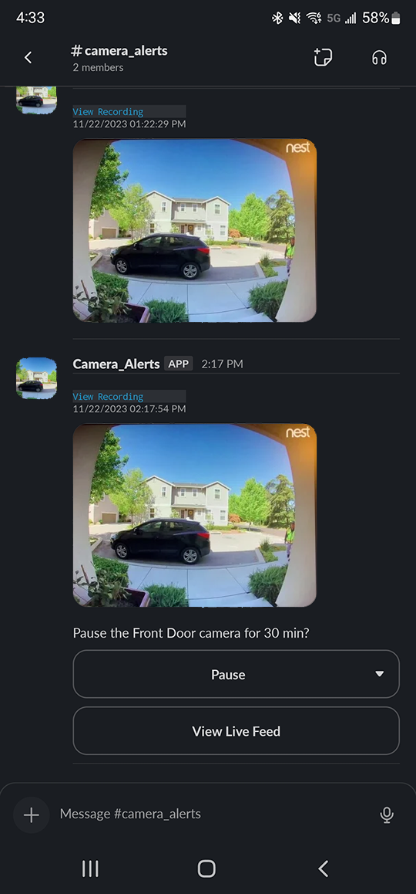
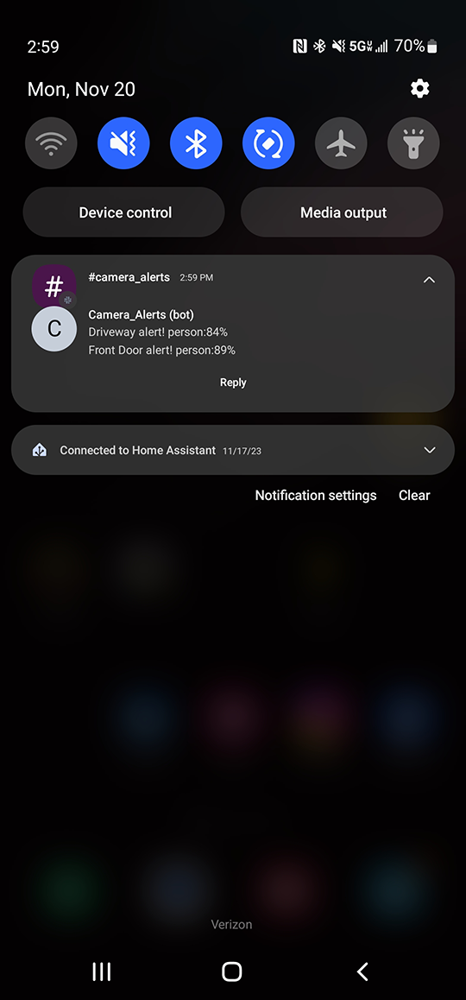

# Blue Iris Alerts
Alerting tool for Blue Iris. Sends an alert that allows the user to view image, recording, live feed and the option to pause the alerts.
Current supported clients:
* Slack

## Requirements
1. Blue Iris
2. Slack Account
3. Publicly accessible domain or IP address to host web server (via port forward and/or proxy)
4. Publicly accessible Blue Iris web server (via port forward and/or proxy)

## Server
APIs for interacting with the alert. Pause button, live feed, recording.
[Server Documentation](/server/README.md)

## Client
Python script to execute from BlueIris to send the alert.
[Client Documentation](/client/README.md)

## Slack
* Follow the following instructions on creating a new app and installing it to your channel: https://api.slack.com/start/quickstart
* Under `Interactivity & Shortcuts`, set `Request URL` to the public URL of the server. IE: https://domain.com/blueiris_alerts/interactivity
* Under `OAuth & Permissions` set the following scopes:
    - Bot Token Scopes:
        * channels:history
        * channels:read
        * chat:write
        * groups:history
        * groups:read
        * im:history
        * im:read
        * mpim:history
        * mpim:read
* Copy `Bot User OAuth Token` under `OAuth & Permissions`. This will be the `SLACK_API_TOKEN` in the client/server .env file.

## Todo:
- Error Handling
- Github Action
