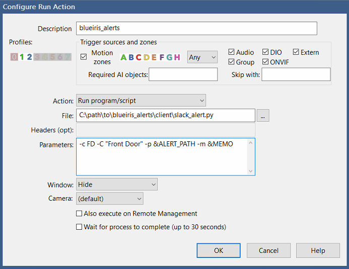

# Client
Python script to execute from BlueIris to send the alert.

## Script Parameters
| Parameter      | Help | Required |
| ----------- | ----------- | ----------- |
| -c --camera | Alerting Camera Short Name | Required |
| -C --camera_full | Alerting Camera Full Name | Optional |
| -p --path | Name of Alert jpg. Can be passed in via BI Variable: `ALERT_PATH` | Optional |
| -m --memo | AI memo. Can be passed in via BI Variable: `&MEMO` | Optional |
| -o --offline | For Watchdog alerts. Camera is Offline | Optional |
| -O --online | For Watchdog alerts. Camera is Online | Optional |

## Setup
* Enable `Web Server` in Blue Iris config. (Setup to be accessible publicly)
* Create a user in Blue Iris. Must be `Admin` to pause/unpause. 
* Install `Python 3.x` and `git` (if cloning repo) on BlueIris System
    - Note: Make sure you install python for all users or you may run into issues depending on what user you are running blue iris as
* Clone or download repo
* Install requirements.txt `pip3 install -r client/requirements.txt`
* Copy client/.env.template to `client/.env`
* Fill out the required variables in `client/.env`

| Variable      | Description | Example | Required |
| ----------- | ----------- | ----------- | ----------- |
| SERVER_URL | The public URL where the server is hosted | "https://serverdomain.com" | Required |
| ENCRYPTION_PASSWORD | Random string used to encrypt passwords. Needs to be the same on the client and server. | "abc123efg456" | Required |
| SLACK_API_TOKEN | Slack App Bot User OAuth Token | "xoxb-456789..." | Required |
| SLACK_CHANNEL | Name of the Slack Channel to send alerts | "camera_alerts" | Required |
| BLUEIRIS_API_USER | Blue Iris User | "blueiris_alerts" | Required |
| BLUEIRIS_API_PASSWORD | Blue Iris User Password | "somesecretpassword" | Required |
| BLUEIRIS_WEB_URL | Public URL of Blue Iris Web Server | "https://blueirisdomain.com" | Required |
| LOG_LEVEL | Logging level: DEBUG, INFO, WARNING, ERROR, CRITICAL, DEBUG | DEBUG | Optional (Default: INFO) |

## Alerts
* Go to the `Alerts` tab under camera settings
* Under Actions, click `On alert...`
* Add new `Run a program or write to a file` action
* Configure action:

    - `FD` is the short name of your camera
    - `Front Door` is a descriptive name of your camera

## Watchdog
### Offline
* Go to the `Watchdog` tab under camera settings
* Click `On loss of signal...`
* Add new `Run a program or write to a file` action
* Configure action:

### Online
* Go to the `Watchdog` tab under camera settings
* Click `On signal restoration...`
* Add new `Run a program or write to a file` action
* Configure action:

